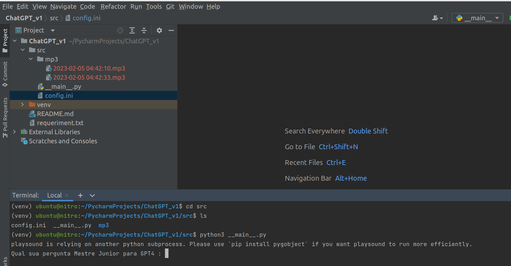

# Arquitetura:

A arquitetura do código consiste em ler uma configuração de um arquivo "config.ini", que contém a API key do OpenAI. 
Em seguida, há um loop infinito que permite ao usuário fazer perguntas ao modelo de linguagem OpenAI.
A resposta do modelo é exibida na tela e transformada em áudio usando a biblioteca gTTS. 
O áudio é salvo como um arquivo MP3 e reproduzido com a biblioteca playsound. 
O programa pode ser encerrado pelo usuário digitando "sair", e todos os arquivos MP3 gerados são excluídos.

# Requisitos:

Biblioteca configparser
Biblioteca os
Biblioteca shutil
Biblioteca openai
Biblioteca datetime
Biblioteca gTTS
Biblioteca playsound
Acesso à API do OpenAI com uma chave API válida
Diretório mp3 para salvar os arquivos de áudio gerados.

# Dependencias
configparser
openai
gtts
playsound
datetime

# Para ativar um ambiente virtual (virtual environment) em Python, você pode seguir os seguintes passos:

Instale o pacote virtualenv, caso ainda não tenha feito: pip install virtualenv
Crie o ambiente virtual:  virtualenv nome_do_ambiente
Ative o ambiente virtual: source nome_do_ambiente/bin/activate

